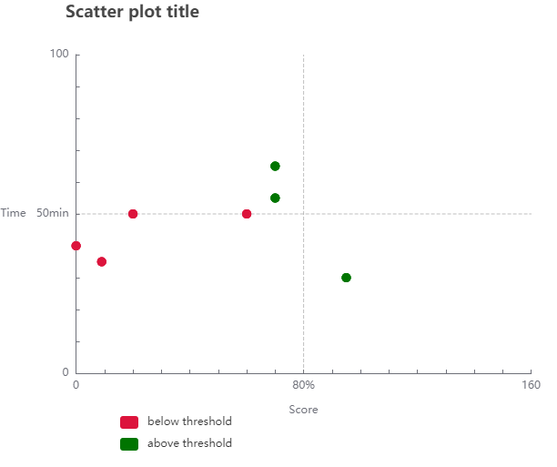

# Easy Scatter Plot
Dots are used to indicate values for two separate numeric variables in a scatter plot (also known as a scatter chart or scatter graph). The values for each data point are shown by the position of each dot on the horizontal and vertical axes. Scatter plots are used to see how variables relate to one another.

This library helps to draw scatter plot diagrams with minimal effort.

## Installation

Run the following command to install this package.

```bash
npm install react-easy-scatter-plot
```


To import the library.
```bash
import Scatterplot from "react-easy-scatter-plot";
```

Versions used in this library are as follows,
```bash
"dependencies": {
    ...
    "react": "^17.0.2",
    "react-dom": "^17.0.2",
    "react-scripts": "4.0.3",
    ...
  },

"devDependencies": {
    "@babel/cli": "^7.14.8",
    "@babel/preset-react": "^7.14.5"
  }
``` 

The library could be used as follows inside a react component

```bash
import Scatterplot from "react-easy-scatter-plot";

function Scattermain() {

  /**
   * Import the dataset in the following format
   */
  const data = {
    scatterdata: [
      {
        itemname: "Student A",
        axis: [0, 40],
      },
      {
        itemname: "Student B",
        axis: [70, 55],
      },
      {
        itemname: "Student C",
        axis: [70, 65],
      },
      {
        itemname: "Student D",
        axis: [60, 50],
      },
      {
        itemname: "Student E",
        axis: [20, 50],
      },
      {
        itemname: "Student F",
        axis: [95, 30],
      },
      {
        itemname: "Student G",
        axis: [9, 35],
      },
    ],
  };

  /** 
   *  Make sure to use a function simillar to following to override default functionality of tooltip 
   *  params : {
       "name" : itemname,
       "xdata": Value of X coordinate,
       "ydata": Value of Y coordinate
      } 
   */
  const tooltipbody = (params) => {
 
    return "<div>\
    <h3>This is working !</h3><hr/>\
     Title Name&ensp;: " + params.name + "<br>\
     Score&emsp;&emsp;&emsp;: " + params.xdata + "<br>\
     Time&emsp;&emsp;&nbsp&emsp;: " + params.ydata + "\
     </div>";
  };

  return (
    <div className="Scattermain">
      <Scatterplot
       title={"Scatter plot title"}
        height={500}
        width={500}
        dotsize={10}
        axis_x_max={160}
        axis_y_max={100}
        axis_x_divider={true}
        axis_y_divider={true}
        axis_x_suffix={"%"}
        axis_y_suffix={"min"}
        axis_x_name={"Score"}
        axis_y_name={"Time"}
        axis_x_threshold={70}
        axis_x_belowthreshold_label={"below threshold"}
        axis_x_belowthreshold_color={"#DC143C"}
        axis_x_abovethreshold_label={"above threshold"} //At least this label should be specified
        axis_x_abovethreshold_color={"#007500"}
        dataset={data.scatterdata}
        tooltip={(e) => tooltipbody(e)} //Can either pass as a string or as a funtion
        // tooltip={"This is tooltip"}
      />
    </div>
  );
}

export default Scattermain;
``` 


## Want to play with code ?

1. Clone the repository
2. 'npm start' to start on local environment 
3. Open your browser and navigate to 'http://localhost:3000/scatter'

## Sample Outputs
### 1. The output of v1.0.x is as follows 



### 2. The tooltip output of v1.0.x is as follows 
#### (This output is according to the custom tooltip element created in the above example, this can be further customized) 


Make sure to download the latest release version to experience the advanced features